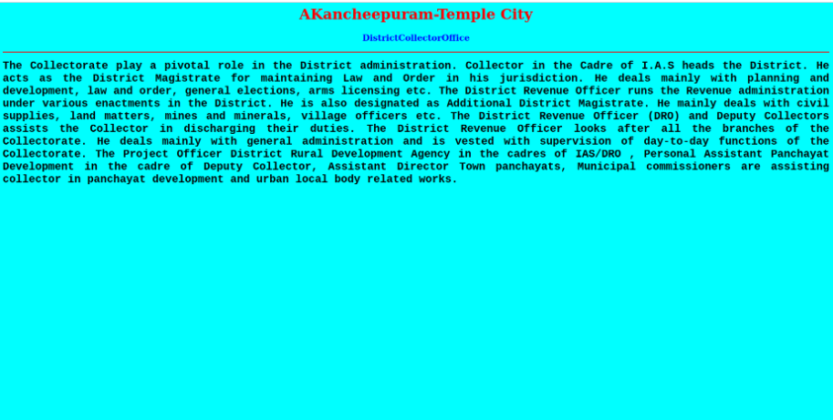
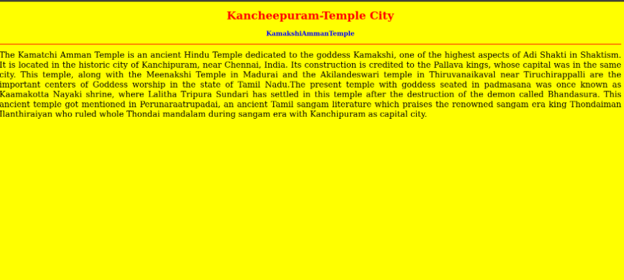
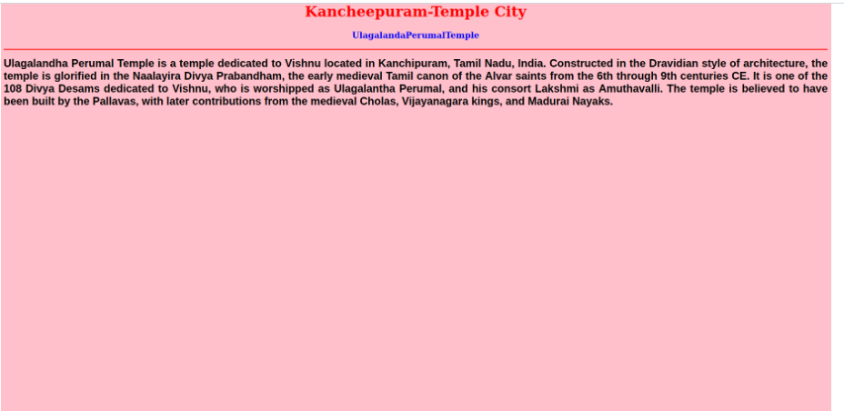
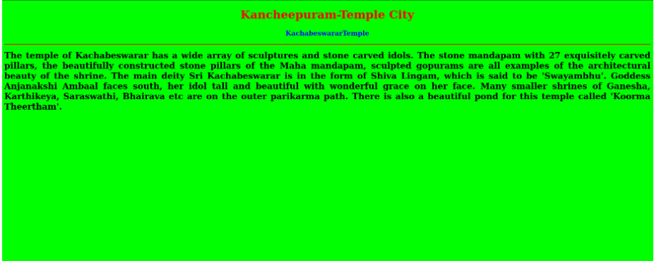
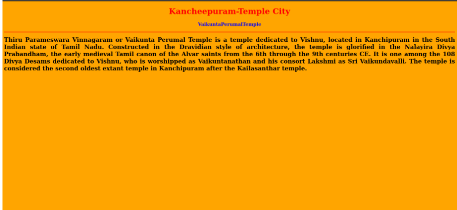

# Places Around Me
## AIM:
To develop a website to display details about the places around my house.

## Design Steps:

Step 1:
Clone the github repository into Thei IDE.

Step 2:
Create a new Django project

Step 3:
Write the needed HTML code.

Step 4:
Run the Django server and execute the HTML files.

## Code:
map.html
<!DOCTYPE html>
<html lang="en">
<head>
<title>My City</title>
</head>
<body>
<h1 align="center">
<b>Kancheepuram-Temple City</b>
</h1>
<h3 align="center">
<b> kanishka (22003409)</b>
</h3>

<map name="MyCity">
<area shape="rectangle" coords="398,815,558,900" href="/static/html/off.html" title="DistrictCollectorOffice">
<area shape="rectangle" coords="712,41,872,126" href="/static/html/tem1.html" title="KamakshiAmmanTemple">
<area shape="rectangle" coords="860,115,1020,169" href="/static/html/tem2.html" title="UlagalandaPerumalTemple">
<area shape="rectangle" coords="661,161,821,215" href="/static/html/tem3.html" title="KachabeswararTemple">
<area shape="rectangle" coords="1106,211,1266,265" href="/static/html/tem4.html" title="VaikuntaPerumalTemple">
</map>

</body>
</html>

off.html

<!DOCTYPE html>
<html lang="en">
<head>
<title>DistrictCollectorOffice</title>
</head>
<body bgcolor="cyan">
<h1 align="center">
<b>AKancheepuram-Temple City</b>
</h1>
<h3 align="center">
<b>DistrictCollectorOffice</b>
</h3>

<b>
The Collectorate play a pivotal role in the District administration. Collector in the Cadre of I.A.S heads the District.
He acts as the District Magistrate for maintaining Law and Order in his jurisdiction. He deals mainly with planning and 
development, law and order, general elections, arms licensing etc.

The District Revenue Officer runs the Revenue administration under various enactments in the District. He is also 
designated as Additional District Magistrate. He mainly deals with civil supplies, land matters, mines and minerals, 
village officers etc.

The District Revenue Officer (DRO) and Deputy Collectors assists the Collector in discharging their duties. The 
District Revenue Officer looks after all the branches of the Collectorate. He deals mainly with general administration 
and is vested with supervision of day-to-day functions of the Collectorate.

The Project Officer District Rural Development Agency in the cadres of IAS/DRO , Personal Assistant Panchayat Development 
in the cadre of Deputy Collector, Assistant Director Town panchayats, Municipal commissioners are assisting collector in 
panchayat development and urban local body related works.
</b>

</body>
</html>

tem1.html
<!DOCTYPE html>
<html lang="en">
<head>
<title>KamakshiAmmanTemple</title>
</head>
<body bgcolor="yellow">
<h1 align="center">
<b>Kancheepuram-Temple City</b>
</h1>
<h3 align="center">
<b>KamakshiAmmanTemple</b>
</h3>

The Kamatchi Amman Temple is an ancient Hindu Temple dedicated to the goddess Kamakshi, one of the highest aspects of 
Adi Shakti in Shaktism. It is located in the historic city of Kanchipuram, near Chennai, India. Its construction is 
credited to the Pallava kings, whose capital was in the same city. This temple, along with the Meenakshi Temple in 
Madurai and the Akilandeswari temple in Thiruvanaikaval near Tiruchirappalli are the important centers of Goddess 
worship in the state of Tamil Nadu.The present temple with goddess seated in padmasana was once known as Kaamakotta 
Nayaki shrine, where Lalitha Tripura Sundari has settled in this temple after the destruction of the demon called 
Bhandasura. This ancient temple got mentioned in Perunaraatrupadai, an ancient Tamil sangam literature which praises 
the renowned sangam era king Thondaiman Ilanthiraiyan who ruled whole Thondai mandalam during sangam era with 
Kanchipuram as capital city. 

</body>
</html>

tem2.html
<!DOCTYPE html>
<html lang="en">
<head>
<title>UlagalandaPerumalTemple</title>
</head>
<body bgcolor="pink">
<h1 align="center">
<b>Kancheepuram-Temple City</b>
</h1>
<h3 align="center">
<b>UlagalandaPerumalTemple</b>
</h3>

<b>
Ulagalandha Perumal Temple is a temple dedicated to Vishnu located in Kanchipuram, Tamil Nadu, India. Constructed in 
the Dravidian style of architecture, the temple is glorified in the Naalayira Divya Prabandham, the early medieval 
Tamil canon of the Alvar saints from the 6th through 9th centuries CE. It is one of the 108 Divya Desams dedicated 
to Vishnu, who is worshipped as Ulagalantha Perumal, and his consort Lakshmi as Amuthavalli. The temple is believed 
to have been built by the Pallavas, with later contributions from the medieval Cholas, Vijayanagara kings, and 
Madurai Nayaks.
</b>

</body>
</html>

tem3.html
<!DOCTYPE html>
<html lang="en">
<head>
<title>KachabeswararTemple</title>
</head>
<body bgcolor="lime">
<h1 align="center">
<b>Kancheepuram-Temple City</b>
</h1>
<h3 align="center">
<b>KachabeswararTemple</b>
</h3>

<b>   
The temple of Kachabeswarar has a wide array of sculptures and stone carved idols. The stone mandapam with 27 
exquisitely carved pillars, the beautifully constructed stone pillars of the Maha mandapam, sculpted 
gopurams are all examples of the architectural beauty of the shrine. The main deity Sri Kachabeswarar is in 
the form of Shiva Lingam, which is said to be 'Swayambhu'. Goddess Anjanakshi Ambaal faces south, her idol 
tall and beautiful with wonderful grace on her face. Many smaller shrines of Ganesha, Karthikeya, Saraswathi, 
Bhairava etc are on the outer parikarma path. There is also a beautiful pond for this temple called 'Koorma 
Theertham'.
</b>

</body>
</html>

tem4.html
<!DOCTYPE html>
<html lang="en">
<head>
<title>VaikuntaPerumalTemple</title>
</head>
<body bgcolor="orange">
<h1 align="center">
<b>Kancheepuram-Temple City</b>
</h1>
<h3 align="center">
<b>VaikuntaPerumalTemple</b>
</h3>

<b>
Thiru Parameswara Vinnagaram or Vaikunta Perumal Temple is a temple dedicated to Vishnu, located in Kanchipuram 
in the South Indian state of Tamil Nadu. Constructed in the Dravidian style of architecture, the temple is 
glorified in the Nalayira Divya Prabandham, the early medieval Tamil canon of the Alvar saints from the 6th 
through the 9th centuries CE. It is one among the 108 Divya Desams dedicated to Vishnu, who is worshipped as 
Vaikuntanathan and his consort Lakshmi as Sri Vaikundavalli. The temple is considered the second oldest extant 
temple in Kanchipuram after the Kailasanthar temple. 
</b>

</body>
</html>

## Output:

## Result:
The program for implementing image map is executed successfully